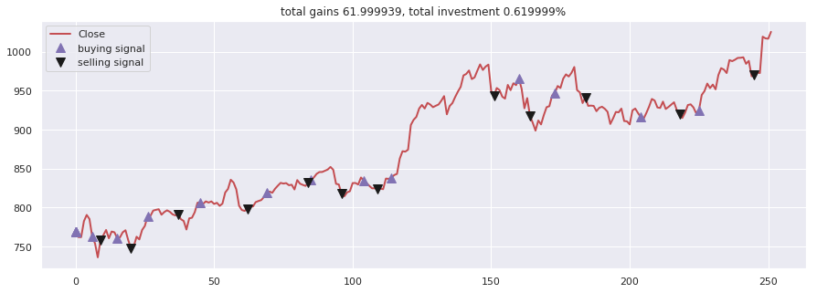

# Machine Learning Engineer Nanodegree
## Capstone Proposal
Jörg Strebel  
October 10th 2019

## Proposal

### Domain Background
As people age, they inevitably retire from their jobs to live off their savings. If you google for "retirement investing today", 
you will find around 143 million related web pages on the WWW. So the topic is very relevant to many people. In Germany, 
a regular employee has to 
spend a certain percentage of his salary on a state-run insurance, but they can also opt to save more an put the money 
into financial products to secure their financial needs during retirement. One possible way to invest money for retirement 
is to participate in the stock market. This option has become more important over the last 10 years, as the fixed-interest 
investment opportunities have largely vanished or yield unsatisfactory profits.

If a person then chooses to use the stock market for long-term retirement investment, they need to have a sound and secure 
investment strategy, i.e. how much to invest, when to buy, what to buy (or sell). Ideally, the strategy leads to a long and steady 
increase of the value of the portfolio, so that the money is available when they retire. 
Now the problem arises , how the individual can come up with such a strategy. 

How to do retirement investing has been a serious research topic over the last decades (e.g. [Farhi and Panageas: Saving and investing for early retirement: A theoretical analysis][1]
, [Gerber and Shiu: Investing for Retirement][2], [Bierwirth: INVESTING FOR RETIREMENT: USING THE PAST TO MODEL THE FUTURE][3]). 
I also have a personal motivation to investigate this problem, as I am an 
active investor at German, European and US stock exchanges (mainly ETFs). If this project is successful, it will be very 
helpful for my investment decisions.  

### Problem Statement
This capstone project aims to solve the problem of finding a good long-term investment strategy under budget, time and 
risk constraints on ETFs suitable for retirement investing. Currently, investors that follow a passive approach usually have 
simple strategies which might leave money on the table, and investors that follow an active approach need a lot of time 
to inform themselves and make trading decisions. An investor usually faces a budget and time constraint, as they invest only a 
limited amount of money per time period (e.g. per month) and they would like to minimize the overall transaction fees; 
also, the investor face a risk constraint, as they cannot afford to lose their retirement savings.   

The assessment of the algorithm to find such a strategy (i.e. the learning part of an agent) is straightforward, as you 
can reuse the existing financial KPIs like returns, profitability, volatility etc. Both the inputs (trading actions) and 
the outputs (financial outcomes) are quantifiable, measurable and replicable (for historic stock data).

[Reinforcement Learning for Finance][9]

[Snow - Machine Learning in Asset Management][10]


### Datasets and Inputs
_(approx. 2-3 paragraphs)_

```
In this section, the dataset(s) and/or input(s) being considered for the project should be thoroughly described, such 
as how they relate to the problem and why they should be used. Information such as how the dataset or input is (was) 
obtained, and the characteristics of the dataset or input, should be included with relevant references and citations 
as necessary It should be clear how the dataset(s) or input(s) will be used in the project and whether their use is 
appropriate given the context of the problem.
```

Historic stock data of three indices (daily data granularity):
- S&P 500 index: https://finance.yahoo.com/quote/%5EGSPC/history?p=%5EGSPC, 
https://www.ariva.de/ishares_s-p_500_ucits_etf-fonds?utp=1, https://www.ariva.de/ishares_s-p_500_ucits_etf-fonds/historische_kurse
- MSCI World Index: https://finance.yahoo.com/quote/X010.DE/history?p=X010.DE, https://www.ariva.de/comstage_msci_world_trn_ucits_etf-fonds
- STOXX EUROPE 600 ETF: https://www.ariva.de/db_x-tr-stoxx_europe_600_etf_inhaber-anteile_1c-fonds/historische_kurse

Columns: Date, open, high, low, close

Financial Parameters: 
- monthly savings and initial budget; no credit will be considered. 
- Transaction fees based on DAB Bank for direct orders (no savings plan). This is likely to be a transaction cost rate 
based on the trade volume (see also [Teddy Koker's Blog][6]).


### Solution Statement
_(approx. 1 paragraph)_

```
In this section, clearly describe a solution to the problem. The solution should be applicable to the project domain and 
appropriate for the dataset(s) or input(s) given. Additionally, describe the solution thoroughly such that it is clear 
that the solution is quantifiable (the solution can be expressed in mathematical or logical terms) , measurable 
(the solution can be measured by some metric and clearly observed), and replicable (the solution can be reproduced and 
occurs more than once).
```

I would like to suggest a reinforcement-learning based agent as a solution. The agent would decide when to trade and 
how much to buy from the three given ETFs. It is also supposed to stay within the given budget constraints. The agent 
learns a trading strategy based on historical stock data and then runs daily and outputs the percentage amounts to buy 
or sell from the funds in the portofolio.
The goal is not to generate sustainable or supreme  
&alpha; ([Definition](https://www.investopedia.com/articles/investing/092115/alpha-and-beta-beginners.asp)), but to 
automate the investment decision (and free the investor of manual labour).  

[Wikifolio](https://www.wikifolio.com/de/de/home), a German company, uses a social media platform to share investment 
portfolios of platform members and offers the chance to investors to put their money in one of these portfolios. If a 
trading agent was successful, it could be used there as well.      

The project does not focus on long-term stock forecasting using statistical methods (e.g. like in 
[Theory of Long-Term Stock Forecasting][8]), but on reinforcement learning-based solutions. 


### Benchmark Model
_(approximately 1-2 paragraphs)_

```
In this section, provide the details for a benchmark model or result that relates to the domain, problem statement, and 
intended solution. Ideally, the benchmark model or result contextualizes existing methods or known information in the 
domain and problem given, which could then be objectively compared to the solution. Describe how the benchmark model or 
result is measurable (can be measured by some metric and clearly observed) with thorough detail.
```

The benchmark for my proposed RL trading algorithm would be a passive dollar-cost averaging strategy 
([Link](https://en.wikipedia.org/wiki/Dollar_cost_averaging)) in combination with a buy-and-hold strategy 
([Link](https://en.wikipedia.org/wiki/Buy_and_hold)). In essence, the investor regularly buys investment products for a 
constant amount of money and then holds these products for a long period of time. Such a strategy would typically be 
found with long-term investors building a retirement portfolio.    

This strategy minimizes risk, but it may also overlook opportunities and does not take advantage of the market direction.
The benchmark strategy is implemented in the same programming framework as the RL agent and it is compared on the same 
data from the same financial products.
 

### Evaluation Metrics
In the end, there are two investment strategies, which are evaluated using the stock data in the test period. The 
metric to compare both strategies will be the total value increase after the test period, i.e. how much has the value 
of the portfolio increased using either one of the trading strategies. You can then calculate the percentage increase based 
on the initial budget. A similar approach is followed in [Stock prediction models][5].
The total value is the Euro value of the portfolio at the last day of the test period plus the remaining budget.

[Teddy Koker's Blog entry][6] uses the Sharpe ratio as a metric for the risk-adjusted  performance of an investment 
over time. This metric might be an alternative to the purely monetary metric given above, as it includes the associated 
risk.

### Project Design
_(approx. 1 page)_

```
In this final section, summarize a theoretical workflow for approaching a solution given the problem. Provide thorough 
discussion for what strategies you may consider employing, what analysis of the data might be required before being 
used, or which algorithms will be considered for your implementation. The workflow and discussion that you provide 
should align with the qualities of the previous sections. Additionally, you are encouraged to include small 
visualizations, pseudocode, or diagrams to aid in describing the project design, but it is not required. 
The discussion should clearly outline your intended workflow of the capstone project.
```

Data preparation: 
- standardization and/or scaling, null-value treatments etc. of stock values
- creation of a common calendar for all three indices

Parameters:
- 10 years of stock data, with the last 2 years as test data

Reward function candidates:  
- [deep_trader][4] reward based on sales profit depending on action
- [Stock prediction models][5]: rate of return = ((total budget - initial budget) / initial budget)
- [Wang et al. - Deep Q-trading][7] shows how to use Q-learning for trading decisions and they found that the accumulated 
wealth over n days in the past was a good candidate for a reward function.  

Reward function properties:
- Penalties for overdrawing the monthly available savings budget, for selling more funds than available in the portfolio 
and for going into debt when buying funds. 
- the reward function will be properly scaled, either using `tanh()` or a similar function. 

Agent design: DDPG agent (based on source code from the Udacity quadcopter project).

State space: 
- the state consists of the last N values of the ETF index prices, the current portfolio (i.e. number of shares per fund) 
and the current budget
- the state is continuous as it contains real-valued prices, budgets and funds.

Action space:
- the action space is continuous as the agent can decide on the number of shares to trade (or 0 if it does not trade) for 
each fund. A positive amount means buying funds and a negative amount means selling funds. 

The training process follows the example of [Stock prediction models][5] and [Teddy Koker's Blog entry][6]; its 
parameters look as follows:
- The window size determines, what temporal section of the values is considered by the agent; for example, the agent might 
only be trained on the last two weeks of closing values. The idea is to have a sliding window over the fund price time series.
- The neural networks are trained in a number of iterations, so that convergence is reached. If the total reward after 
each iteration does not change significantly anymore, the training can be stopped early. 

Output:
A chart with trading signals for an individual index / product. Please see the following chart as an example 
(source: [Stock prediction models][5]):



The user can clearly see the value development and the trading actions in one chart (based on the learned trading policy). 
The same type of chart is provided for the benchmark strategy.  

Workflow:
- manual data retrieval from the Internet
- implement data loading, cleansing and preprocessing using Python pandas package
- create test and training data set
- implement agent based on Python source code in  https://github.com/udacity/RL-Quadcopter-2
- train agent and tweak network hyperparameters, network architecture and reward function
- build visualization based on [Stock prediction models][5], i.e. charts and tables.


### References
[1]: https://www.sciencedirect.com/science/article/abs/pii/S0304405X06001127
[2]: https://www.tandfonline.com/doi/abs/10.1080/10920277.2000.10595899
[3]: https://web.b.ebscohost.com/abstract?direct=true&profile=ehost&scope=site&authtype=crawler&jrnl=10403981&AN=5558183&h=eT7kaJlvwTYF03fBKPVPAjxrYbbIg71Il8Becp1HEiwL8qqWbRJWMYAXYjBqROYHIY%2fvI3OxVdeCqEclAZfgpQ%3d%3d&crl=c&resultNs=AdminWebAuth&resultLocal=ErrCrlNotAuth&crlhashurl=login.aspx%3fdirect%3dtrue%26profile%3dehost%26scope%3dsite%26authtype%3dcrawler%26jrnl%3d10403981%26AN%3d5558183
[4]: https://github.com/deependersingla/deep_trader
[5]: https://github.com/huseinzol05/Stock-Prediction-Models
[6]: https://github.com/teddykoker/blog.git
[7]: http://cslt.riit.tsinghua.edu.cn/mediawiki/images/5/5f/Dtq.pdf
[8]: https://github.com/Hvass-Labs/FinanceOps
[9]: https://github.com/jjakimoto/DQN
[10]: https://papers.ssrn.com/sol3/papers.cfm?abstract_id=3420952

