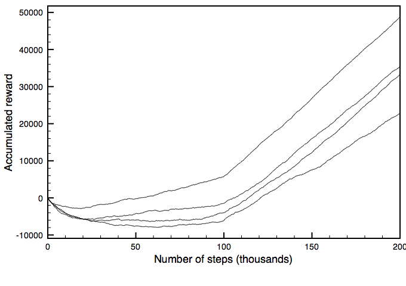

# Machine Learning Engineer Nanodegree
## Capstone Proposal
Jörg Strebel  
October 15th 2019

## Proposal

### Domain Background
As people age, they inevitably retire from their jobs to live off their savings. If you google for "retirement investing today", 
you will find around 143 million related web pages on the WWW. So the topic is very relevant to many people. In Germany, 
a regular employee has to 
spend a certain percentage of his salary on a state-run insurance, but they can also opt to save more an put the money 
into financial products to secure their financial needs during retirement. One possible way to invest money for retirement 
is to participate in the stock market. This option has become more important over the last 10 years, as the fixed-interest 
investment opportunities have largely vanished or yield unsatisfactory profits.

If a person then chooses to use the stock market for long-term retirement investment, they need to have a sound and secure 
investment strategy, i.e. how much to invest, when to buy, what to buy (or sell). Ideally, the strategy leads to a long and steady 
increase of the value of the portfolio, so that the money is available when they retire. 
Now the problem arises , how the individual can come up with such a strategy. 

How to do retirement investing has been a serious research topic over the last decades (e.g. [Farhi and Panageas: Saving and investing for early retirement: A theoretical analysis][1]
, [Gerber and Shiu: Investing for Retirement][2], [Bierwirth: INVESTING FOR RETIREMENT: USING THE PAST TO MODEL THE FUTURE][3]). 
I also have a personal motivation to investigate this problem, as I am an 
active investor at German, European and US stock exchanges (mainly ETFs). If this project is successful, it will be very 
helpful for my investment decisions.  

### Problem Statement
This capstone project aims to solve the problem of finding a good long-term investment strategy under budget, time and 
risk constraints on ETFs suitable for retirement investing. Currently, investors that follow a passive approach usually have 
simple strategies which might leave money on the table, and investors that follow an active approach need a lot of time 
to inform themselves and make trading decisions. An investor usually faces a budget and time constraint, as they invest only a 
limited amount of money per time period (e.g. per month) and they would like to minimize the overall transaction fees; 
also, the investor face a risk constraint, as they cannot afford to lose their retirement savings.   

The assessment of the algorithm to find such a strategy (i.e. the learning part of an agent) is straightforward, as you 
can reuse the existing financial KPIs like returns, profitability, volatility etc. Both the inputs (trading actions) and 
the outputs (financial outcomes) are quantifiable, measurable and replicable (for historic stock data).

The problem itself has already been researched scientifically (e.g. [Reinforcement Learning for Finance][9] and 
[Snow - Machine Learning in Asset Management][10]).

### Datasets and Inputs
Any trading strategy has to be backtested using historic stock data; this project is using the historic stock data of 
the following three indices with daily data granularity:

- S&P 500 index: 
  - [https://finance.yahoo.com/quote/%5EGSPC/history?p=%5EGSPC](https://finance.yahoo.com/quote/%5EGSPC/history?p=%5EGSPC), 
  - [https://www.ariva.de/ishares_s-p_500_ucits_etf-fonds/historische_kurse](https://www.ariva.de/ishares_s-p_500_ucits_etf-fonds/historische_kurse)
- MSCI World Index: 
  - [https://finance.yahoo.com/quote/X010.DE/history?p=X010.DE](https://finance.yahoo.com/quote/X010.DE/history?p=X010.DE), 
  - [https://www.ariva.de/comstage_msci_world_trn_ucits_etf-fonds](https://www.ariva.de/comstage_msci_world_trn_ucits_etf-fonds)
- STOXX EUROPE 600 ETF: [https://www.ariva.de/db_x-tr-stoxx_europe_600_etf_inhaber-anteile_1c-fonds/historische_kurse](https://www.ariva.de/db_x-tr-stoxx_europe_600_etf_inhaber-anteile_1c-fonds/historische_kurse)

The three index funds are ideal financial products for retirement investing, as they offer very high diversification, 
and thus very low risk of wild swings or long-term losses. The three ETFs are also globally diversified: one from the US,
 one from Europe and one covering global enterprises. 

The Websites provide the data in one CSV format for each index fund, with the columns: date, open price, high price, 
low price, close price. These are all real-valued columns, so there is no categorical data and no classes. 
Hence there can be no imbalance in the data sets. All funds data consists of time series with a daily granularity and hence,
 they feature the same number of data points. The data set does not show individual stock trades (buy/sell actions), only the closing price, so it is not imbalanced in terms of 
trade decisions.  

The number of data points depends on the number of trading days at the stock exchange. The file `resources/wkn_ETF110_historic.csv` 
gives an example of the data; I plan to use the close price which is available for the complete time period.  For a 10-year 
time period, we have roughly 2170 records for daily stock prices per fund.
Please see the following sample data for MSCI World Index:  

| Date | Open            | High  |  Low  | Close | 
| ------------- | -------------:| -----:| -----:|-----:| 
| 11.10.2019   | 60,9378€ | 60,9378€ | 60,9378€ | 60,9378€ | 
| 10.10.2019 | 60,1189€  |  60,1189€ |  60,1189€ |  60,1189€ |
| 09.10.2019 | 59,7625€  |  59,7625€ |  59,7625€ |  59,7625€ |

Ideally, the historic data would span 10 years of stock data, with the last 2 years as test data.

Other inputs consist of the following financial parameters: 

- available monthly savings of investor in €
- available initial budget in € (no credit will be considered) 
- transaction fees based on DAB Bank for direct orders (no savings plan). This is likely to be a transaction cost rate 
based on the trade volume (see also [Teddy Koker's Blog][6]).

### Solution Statement
As a solution, I would like to suggest a reinforcement-learning based agent, that learn a good trading strategy. 
The agent would decide when to trade and how much to buy from the three given ETFs. 
It is also supposed to stay within the given budget constraints. The agent 
learns a trading strategy based on historical stock data and then runs daily and outputs the amounts to buy 
or sell from the funds in the portofolio.
The goal is not to generate sustainable or supreme  
&alpha; ([Definition](https://www.investopedia.com/articles/investing/092115/alpha-and-beta-beginners.asp)), but to 
automate the investment decision, free the investor of manual labour and take advantage of mid-term market developments. 
The project does not focus on long-term stock forecasting using statistical methods (e.g. like in 
[Theory of Long-Term Stock Forecasting][8]), but on reinforcement learning-based solutions. 

### Benchmark Model
The benchmark for my proposed RL trading algorithm would be a passive dollar-cost averaging strategy 
([Link](https://en.wikipedia.org/wiki/Dollar_cost_averaging)) in combination with a buy-and-hold strategy 
([Link](https://en.wikipedia.org/wiki/Buy_and_hold)). In essence, the investor buys each month investment products for a 
constant amount of money and then holds these products indefinitely. Such a strategy would typically be 
found with long-term investors building a retirement portfolio. At the end of the trading period, the strategy yields a 
portfolio of funds and the remaining budget, which can be added together to give the total value in €. This value is the 
benchmark for my reinforcement learning agent to beat; my RL agent will also produce a portfolio of funds with a total value.
[Wang et al. - Deep Q-trading][7] also use a buy-and-hold strategy as a benchmark for their q-learning trading system.  

This strategy minimizes risk, but it may also overlook opportunities and does not take advantage of the market direction.
The benchmark strategy is implemented in the same programming framework as the RL agent and it is compared on the same 
data from the same financial products over the same time period.

### Evaluation Metrics
The evaluation happens on a subset of the available historic data, the test set. The two investment strategies are 
evaluated using the stock data in this test set. The stock data contains one time series of prices per day per fund, so 
there are no categorical attributes and no risk of imbalanced classes. All three funds time series are available on the 
complete time period under investigation.

It must be noted that the action space is continuous as the agent can sell and buy real-valued amount of shares (under a 
budget constraint). The agent is supposed to detect/learn the more favorable action - that's the goal of reinforcement learning. 
So the agent might learn a highly imbalanced strategy, i.e. it might buy more than it might sell or hold. When the agent 
sees climbing share prices, it will be more inclined to buy stock, as it expects more reward from it. In a bull market, 
the actions will be 
imbalanced towards buying. The actions of the agent are part of the input training set of the critic neural network. 
To counter the effect of imbalanced and self-reinforcing strategies, two measures are taken: 

- a noise function is introduced, that leads the agent to try out random behaviour
- the experience replay buffer is queried in a random fashion so that temporal correlations are broken.     

The metric to compare both strategies will be the total value increase after the test period, i.e. how much has the total value 
of the portfolio increased using either one of the trading strategies. You can then calculate the percentage increase based 
on the initial budget. A similar approach is followed in [Stock prediction models][5].
The total value is the Euro value of the portfolio at the last day of the test period plus the remaining budget.

On a more technical level, the project follows the same approach as the quadcopter project and measures the learning 
process by tracking the development of the total reward. This is a visualization of the learning 
curve of the agent. [Poole and Mackworth 2017](https://artint.info/html/ArtInt_267.html) in their book on artificial 
intelligence also recommend this approach. They use a chart of the cumulative reward over time. 

"One way to show the 
performance of a reinforcement learning algorithm is to plot the cumulative reward (the sum of all rewards received so 
far) as a function of the number of steps. One algorithm dominates another if its plot is consistently above the other. 
[...]
There are three statistics of this plot that are important:

- The asymptotic slope shows how good the policy is after the algorithm has stabilized.
- The minimum of the curve shows how much reward must be sacrificed before it starts to improve.
- The zero crossing shows how long it takes until the algorithm has recouped its cost of learning." 

[A. Proutiere et al.](http://www.it.uu.se/research/systems_and_control/education/2017/relearn/lec3.pdf) from Swedish KTH 
university suggest regret as an evaluation metric for reinforcement learning. Roughly speaking, regret is the 
difference between the cumulative reward of an optimal policy minus the cumulative reward of the learned policy and judges, 
 how much learning/exploration the agent has to do in an environment. In this project, calculating the optimal trading 
 strategy based on the daily closing prices is a non-trivial optimization problem 
and would probably require some sort of linear optimization model (https://en.wikipedia.org/wiki/Integer_programming). 
This would go well beyond the scope of a normal capstone project.

### Project Design
The paragraphs in this section will outline the design decisions around the agent. 

The following reward function candidates are available in the research literature:

- [Teddy Koker's Blog entry][6] uses the Sharpe ratio as a metric for the risk-adjusted  performance of an investment 
over time. This metric might be an alternative to the purely monetary metric given above, as it includes the associated 
risk, but it will only be considered as an extension. 
- [deep_trader][4] uses a reward function based on sales profit per action.
- [Stock prediction models][5] uses rate of return = ((total budget - initial budget) / initial budget) as a reward 
function. The rate of return is calculated over all daily time slots.
- [Wang et al. - Deep Q-trading][7] show how to use Q-learning for trading decisions and they found that the accumulated 
wealth over n days in the past was a good candidate for a reward function. So this project will adopt this approach.

The reward function properties look like this:

- there are penalties for overdrawing the monthly available savings budget, for selling more funds than available in 
the portfolio and for going into debt when buying funds. 
- the reward function will be properly scaled, either using `tanh()` or a similar function. 

The agent state consists of the last N values of the ETF index prices, the current portfolio (i.e. number of shares per fund) 
and the current budget. The state space itself is continuous as it contains real-valued prices, budgets and funds. The 
action space is continuous as the agent can decide per time slot on the number of shares to trade (or 0 if it does 
not trade) for each fund. A positive amount means buying funds and a negative amount means selling funds. 

The learning algorithm is deep deterministic policy gradients (DDPG), based on source code from the Udacity 
quadcopter project). This algorithm fits nicely, as it can process a continuous state and action space and is 
deterministic in nature. 

The training process follows the example of [Stock prediction models][5] and [Teddy Koker's Blog entry][6]; its 
parameters look as follows:

- The window size determines, what temporal section of the values is considered by the agent; for example, the agent might 
only be trained on the last two weeks of closing values. The idea is to have a sliding window over the fund price time series.
- The neural networks are trained with the same input data in a number of iterations, so that convergence is reached. 
If the total reward after each iteration does not change significantly anymore, the training can be stopped early. 

The output of the agent is visualized using a chart with trading signals for an individual index / product. 
Please see the following chart as an example 
(source: [Stock prediction models][5]). Its x-axis are the time slots (days) and its y-axis are the closing share prices.
 The triangles indicate the trading actions.

The user can clearly see the value development and the trading actions in one chart (based on the learned trading policy). 
The same type of chart is provided for the benchmark strategy.

#### Workflow
For the initial development of the trading agent, the following workflow is applied:

1. manual data retrieval from the Internet
2. implement data loading, cleansing and pre-processing using Python pandas package
3. create test and training data set (e.g. in scikit-learn)
4. implement DDPG agent based on Python source code in https://github.com/udacity/RL-Quadcopter-2
5. train agent and manually tweak network hyperparameters, network architecture and reward function
6. build visualization based on [Stock prediction models][5], i.e. charts (using matplotlib) and 
tables (using pandas in a Jupyter notebook)

Data cleansing and pre-processing includes the following activities:

- standardization and/or scaling, null-value treatments etc. of ETF index prices
- creation of a common calendar for all three indices, on which the individual ETF index prices are joined. 

#### Extensions
A possible extension of the described proposal includes the automation of the workflow, such that the stock data is picked 
up daily, and the agent writes out the trading decision regularly to a file or a database.
Another extension could be the automated retraining of the deep network models, e.g. every month. The retraining would 
ensure that the agent catches up on current trends of the stock market. 

[Wikifolio](https://www.wikifolio.com/de/de/home), a German company, uses a social media platform to share investment 
portfolios of platform members and offers the chance to investors to put their money in one of these portfolios. If a 
trading agent was successful, it could be used there as well.      

### References
[1]: https://www.sciencedirect.com/science/article/abs/pii/S0304405X06001127
[2]: https://www.tandfonline.com/doi/abs/10.1080/10920277.2000.10595899
[3]: https://web.b.ebscohost.com/abstract?direct=true&profile=ehost&scope=site&authtype=crawler&jrnl=10403981&AN=5558183&h=eT7kaJlvwTYF03fBKPVPAjxrYbbIg71Il8Becp1HEiwL8qqWbRJWMYAXYjBqROYHIY%2fvI3OxVdeCqEclAZfgpQ%3d%3d&crl=c&resultNs=AdminWebAuth&resultLocal=ErrCrlNotAuth&crlhashurl=login.aspx%3fdirect%3dtrue%26profile%3dehost%26scope%3dsite%26authtype%3dcrawler%26jrnl%3d10403981%26AN%3d5558183
[4]: https://github.com/deependersingla/deep_trader
[5]: https://github.com/huseinzol05/Stock-Prediction-Models
[6]: https://github.com/teddykoker/blog.git
[7]: http://cslt.riit.tsinghua.edu.cn/mediawiki/images/5/5f/Dtq.pdf
[8]: https://github.com/Hvass-Labs/FinanceOps
[9]: https://github.com/jjakimoto/DQN
[10]: https://papers.ssrn.com/sol3/papers.cfm?abstract_id=3420952

